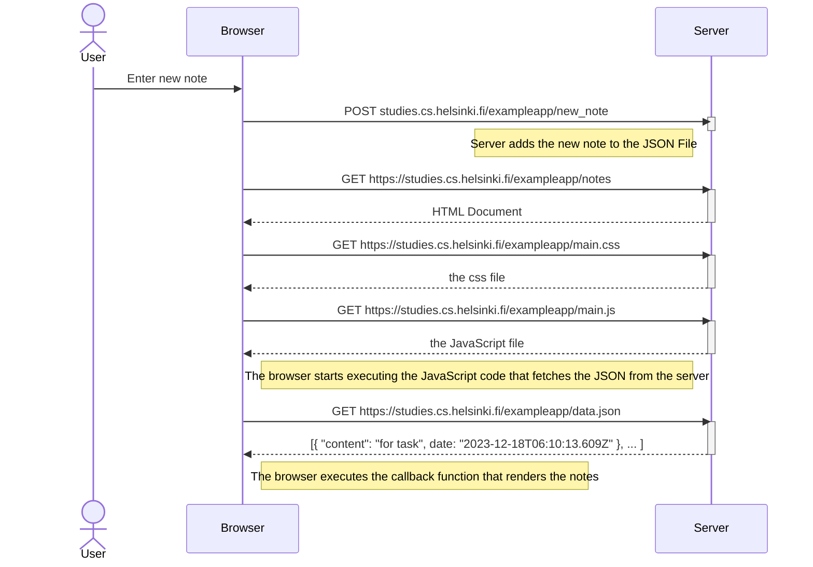

```mermaid
sequenceDiagram
Actor User
Participant Browser
Participant Server

User ->> Browser: Enter new note
Browser ->> Server:POST studies.cs.helsinki.fi/exampleapp/new_note
Activate Server
Deactivate Server
Note Left of Server:Server adds the new note to the JSON File

Browser ->> Server: GET https://studies.cs.helsinki.fi/exampleapp/notes
Activate Server
Server-->>Browser:HTML Document
Deactivate Server
Browser->>Server: GET https://studies.cs.helsinki.fi/exampleapp/main.css
activate Server
Server-->>Browser: the css file
deactivate Server

Browser->>Server: GET https://studies.cs.helsinki.fi/exampleapp/main.js
activate Server
Server-->>Browser: the JavaScript file
deactivate Server
Note right of Browser: The browser starts executing the JavaScript code that fetches the JSON from the server
Browser->>Server: GET https://studies.cs.helsinki.fi/exampleapp/data.json
activate Server
Server-->>Browser: [{ "content": "for task", date: "2023-12-18T06:10:13.609Z" }, ... ]
deactivate Server
Note right of Browser: The browser executes the callback function that renders the notes
```